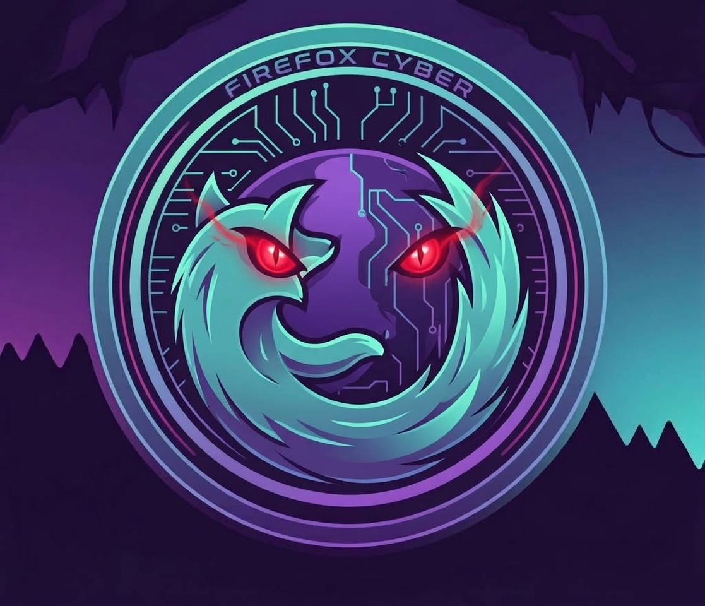

# Firefox Browser



[](LICENSE)
[](Dockerfile)
[](https://www.mozilla.org/firefox/nightly/)
[](https://w3c.github.io/webdriver-bidi/)
[](#support)

Docker image with Firefox Nightly browser with VNC/noVNC support
for remote access and automation via WebDriver BiDi.

## Table of contents

- [Features](#features)
- [Quick Start](#quick-start)
- [Configuration](#configuration)
- [Usage](#usage)
- [Ports](#ports)
- [Project structure](#project-structure)
- [License](#license)
- [Support](#support)

## Features

- Firefox Nightly with headless support via Xvfb
- Interactive VNC access via noVNC web interface
- WebDriver BiDi protocol for automation
- HTTP proxy support
- Profile persistence via volume
- Log size limits (10 MB x 3 files)

## Quick Start

```bash
# Build image
make image-build

# Start container
make compose-up

# Stop container
make compose-down
```

Open noVNC in browser:

```text
http://localhost:3000
```

Create a BiDi session:

```bash
curl -s -X POST http://localhost:9222/session \
  -H "Content-Type: application/json" \
  -d '{"capabilities":{"alwaysMatch":{"webSocketUrl":true}}}'
```

## Configuration

Create a `.env` file (see `.env.example`):

| Variable             | Description                                       |
| -------------------- | ------------------------------------------------- |
| `RESOLUTION`         | Screen resolution                                 |
| `PROXY`              | Proxy URL e.g. `http://host.docker.internal:8138` |
| `FIREFOX_ARGS_EXTRA` | Extra Firefox flags                               |

| Variable             | Default     |
| -------------------- | ----------- |
| `RESOLUTION`         | `1920x1080` |
| `PROXY`              | empty       |
| `FIREFOX_ARGS_EXTRA` | empty       |

## Usage

Start with proxy:

```bash
docker compose up -d
```

Run an automation script against WebDriver BiDi:

```bash
curl -s -X POST http://localhost:9222/session \
  -H "Content-Type: application/json" \
  -d '{"capabilities":{"alwaysMatch":{"webSocketUrl":true}}}'
```

## Ports

| Port | Service                               |
| ---- | ------------------------------------- |
| 9222 | WebDriver BiDi (Firefox Remote Agent) |
| 3000 | noVNC web interface                   |

## Project structure

| File                 | Description                                                  |
| -------------------- | ------------------------------------------------------------ |
| `Dockerfile`         | Debian bookworm-slim with Firefox Nightly, xvfb, x11vnc      |
| `entrypoint.sh`      | Starts Xvfb, VNC, noVNC and Firefox Nightly with BiDi        |
| `docker-compose.yaml`| Service definition with ports and volumes                    |
| `Makefile`           | Build, run, stop commands                                    |
| `.env.example`       | Environment variables template                               |

## License

MIT

## Support

<p align="center">
  <a href="https://tonviewer.com/UQCcbp-mue-7HTjDNQ_ZrKtg-tUxIFu817APmItjXasiBGP3">
    
  </a>
</p>

<p align="center">
  If this tool helps you, consider buying me a coffee!
</p>
